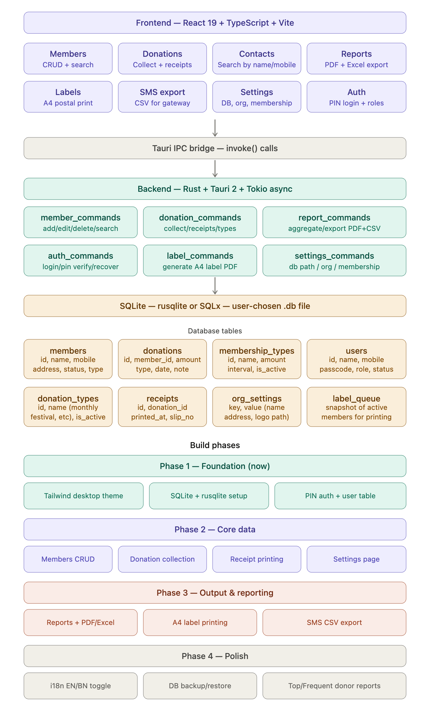

Got everything I need. Let me now draw up the full plan.Now let me build the full architecture plan as a visual diagram.Here's the complete plan. Let me walk you through the key decisions:

**Tech stack additions needed:**
- `rusqlite` or `sqlx` (async) for SQLite in Rust
- `tauri-plugin-dialog` for the DB file picker in Settings
- `printpdf` or `lopdf` crate for generating A4 receipt/label PDFs
- `calamine` + `xlsxwriter` for Excel export
- Tailwind CSS v4 on the frontend

**Database design highlights:**
- `membership_types` is a separate configurable table (set from Settings) with name, amount, interval — exactly as you described
- `donation_types` covers monthly, tri-monthly, half-yearly, festival, voluntary etc — also configurable
- `org_settings` is a simple key-value table for org name, address, logo path (used on receipts and labels)
- `users` table has `role` as an enum: `super_admin`, `admin`, `operator`
- PIN recovery chain: operator → admin → super_admin, all in the same table

**Auth flow:** On first launch, if no users exist, show a setup wizard to create the super-admin. Otherwise, show the PIN login screen.

**DB file flow:** On first launch (or from Settings), user either picks an existing `.db` file or creates a new blank one. The path is stored in the app's config (Tauri's `AppHandle::app_data_dir`).

**Label printing:** One label per A4 page — left half = org sender address (from `org_settings`), right half = member address. Generated as PDF, sent to system print dialog.

---

**Ready to start Phase 1.** Here's the order I suggest we tackle right now:

1. **Tailwind + desktop theme CSS** — sidebar layout, typography, component tokens
2. **SQLite integration** — `rusqlite` in Rust, migrations, DB picker in settings
3. **PIN auth screen + user setup**

Want to start with the Tailwind desktop theme now? I'll set up the sidebar shell, color tokens, and base components that feel like a proper native desktop app.